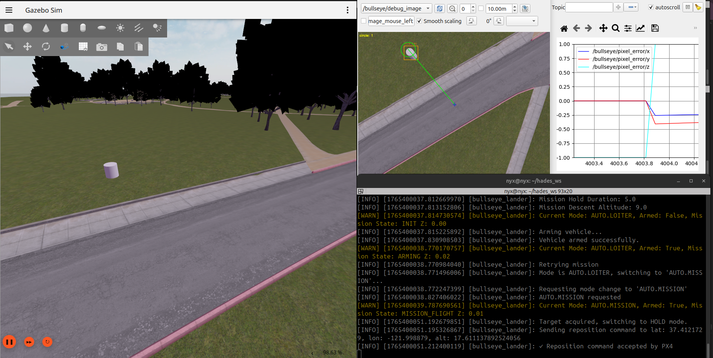
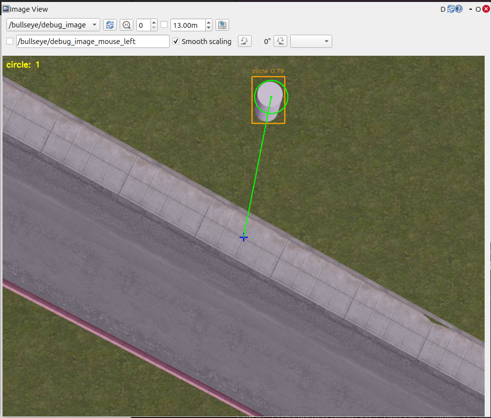
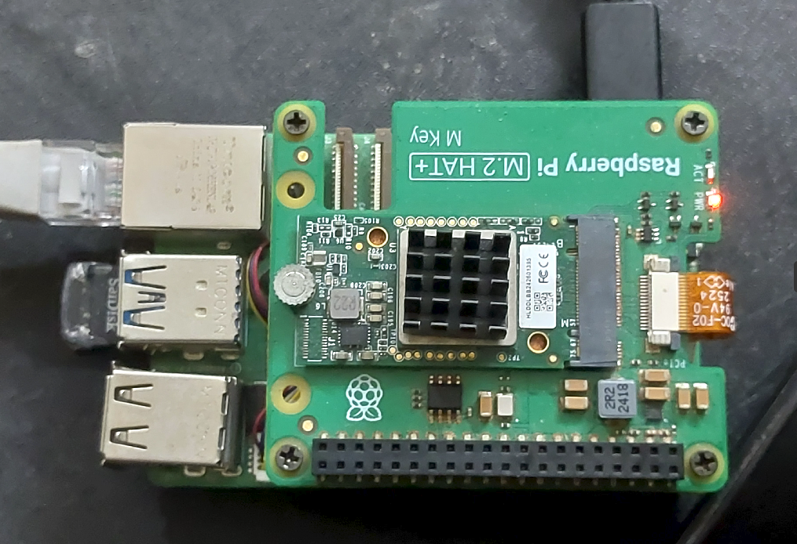

# PX4 · ROS2 · Hailo — Vision-Assisted Payload Drop

**Vision-assisted autonomous payload delivery for PX4.**  
PX4 executes a pre-planned search mission while a Raspberry Pi 5 (with a Hailo-8L accelerator) runs a YOLOv8s-based perception pipeline. When the required target is detected the stack interrupts the mission, aligns the vehicle using OFFBOARD velocity control, descends to a configured drop altitude, triggers the payload release, and then returns or resumes the mission.

  

**Key highlights**
- PX4 integration via MAVROS; mission interruption → OFFBOARD → RTL/resume.
- Hailo-8L accelerated YOLOv8s inference for on-device detection.
- Robust detection filtering (min-detections + EWMA smoothing) to avoid jitter.
- OFFBOARD velocity control mapping (pixel error → velocity) with safety fallbacks.
- Hardware-in-the-loop (HIL) tested: laptop (PX4 SITL + Gazebo) ↔ RPi5 (inference + autonomy).
# AeroHades25-Autonomy

ROS 2 Jazzy package implementing a **vision-assisted autonomous payload-drop
system** for Aerothon 2025 by Team AeroHades (CUSAT).

PX4 executes a pre-planned AUTO.MISSION. A Raspberry Pi 5 running a Hailo-8L
accelerator detects a **white cylindrical target** using a custom YOLOv8s model.
When detected, the autonomy stack:

1. Interrupts the mission.
2. Aligns above the target using vision-based velocity control (OFFBOARD).
3. Descends to a configured drop altitude.
4. Releases payload.
5. Performs **RTL** (default) or **mission resume** (parameter controlled).

> Note: Early prototypes used landing behavior *purely for testing.*  
> The final system performs **hover + descend + payload drop**, not landing.

---

## 📦 Repository Overview (Minimal Version)

- **\`hades_lander/\`** — final ROS 2 package (vision node + autonomy node)  
- **\`config/\`** — MAVROS configuration + future parameters  
- **\`launch/\`** — launch file for running the nodes  
- **\`archive/\`** — early monolithic prototypes (v0–v3); kept for history  
- **\`docs/\`** — system architecture + images/GIFs (expanded later)  
- **\`models/\`** — notes about `.hef` model usage (no model files included)  
- **\`test/\`** — optional style/tests from ROS package template  

---

## 🚀 Features

- Hailo-accelerated YOLOv8s target detection  
- OFFBOARD velocity control for alignment + descent  
- Mission interruption logic (AUTO.MISSION → OFFBOARD → RTL/Resume)  
- Supports Hardware-in-the-Loop (HIL) testing  
- Cleanly documented evolution (archive v0 → v3 → final ROS2 architecture)  

---

## 🔧 Runtime Requirements (Tested Configuration)

- **Ubuntu 24.04 (RPi5)**  
- **ROS 2 Jazzy**  
- **Python 3.12**  
- **PX4 v1.17** (SITL + real flight controller)  
- **Gazebo Harmonic**  
- **QGroundControl**

### Hailo Runtime (RPi5)

Tested with:

- **HailoRT 4.22.0**  
- **TAPPAS Core 5.0.0**  
- GStreamer plugins: `hailonet`, `hailofilter`, `hailotracker`, …  
- Python binding: `hailo-tappas-core-python-binding 5.0.0`  
- Dev utilities: `hailo-apps 25.7.0`

➡️ *This repo does not include `.hef` files or installation instructions.*  
See `models/README.md` for how to use your own model.

---

## 🔄 High-Level Behavior

1. PX4 flies GPS-based search mission  
2. YOLOv8s (Hailo) detects target via downward camera  
3. Companion switches PX4 to OFFBOARD  
4. Drone aligns over target  
5. Drone descends to drop altitude  
6. Payload released  
7. RTL or mission resume  

---

## 🖥️ HIL Simulation (Laptop ↔ RPi5)

**Laptop**  
- PX4 SITL 1.17  
- Gazebo Harmonic  
- MAVROS  
- Camera plugin publishes `/camera/image_raw`

**RPi5**  
- ROS 2 Jazzy  
- `hades_lander` package  
- Hailo inference running YOLOv8s `.hef`  
- Publishes OFFBOARD velocities to PX4  

This enables full autonomy-loop testing with real inference timing.

---

## ⚠️ Safety

Autonomous drone operation is hazardous.

Use only:
- in controlled environments  
- with RC override  
- with proper PX4 failsafes  
- in compliance with UAV laws  

This software is for **research/education** only.

---

## 👥 Credits

- **Team AeroHades (CUSAT)** – Aerothon 2025  
- **Autonomy software, HIL setup, integration:**  
  Gautham P Sankar  
- Other members contributed to model training & hardware integration.

---

## 📄 License

MIT License — see `LICENSE`.

## Technical Highlights

### 1. Perception Pipeline (YOLOv8s → Hailo-8L)
- Custom-trained YOLOv8s model converted to a Hailo `.hef` binary.
- Inference executed on the Raspberry Pi 5 using the Hailo-8L accelerator.
- Post-processing integrates geometric validation to reduce false positives.
- A stabilizing EWMA filter and minimum-detections threshold ensure reliable lock-on before alignment begins.

### 2. Deterministic Autonomy Logic (Finite State Machine)
The mission logic is implemented as a deterministic finite-state machine:
- **SEARCH:** PX4 flies a preplanned mission (AUTO.MISSION).
- **DETECT:** Vision node finds the cylindrical target.
- **INTERRUPT:** Autonomy stack switches PX4 to **OFFBOARD** mode.
- **ALIGN:** Pixel error is converted into body-frame velocity commands (proportional control + yaw compensation).
- **DESCENT:** Controlled vertical descent to a configured drop altitude.
- **DROP:** Payload release is triggered by software.
- **RESUME/RTL:** Depending on user parameter, PX4 resumes the mission or returns to launch.

### 3. Robust Control Mapping (Pixel Error → Velocity)
- Image-space pixel error (dx, dy) is mapped to body-frame velocities.
- Converted to world-frame via real-time yaw from PX4 odometry.
- Velocity is saturated and filtered to prevent oscillations or aggressive corrections.
- Descent is independently regulated with a proportional Z-controller.

### 4. Safety & Recovery
- Time-based “lost-target” counter returns PX4 to AUTO.MISSION if detection is unstable.
- OFFBOARD mode is only commanded when the vehicle is armed and stable.
- Payload drop occurs **only** at safe altitude and stable alignment.

### 5. Hardware-in-the-Loop Architecture
- PX4 SITL + Gazebo Harmonic on laptop.
- RPi5 running ROS2 Jazzy + Hailo inference stack.
- Camera stream forwarded from SITL → RPi for inference.
- OFFBOARD velocity commands returned back to PX4 via MAVROS.
## System Overview

Below is a high-level view of the simulation + perception pipeline during HIL test.  
Gazebo runs PX4 SITL and publishes the camera stream via a ROS Bridge, which is forwarded(only during testing) to the Raspberry Pi 5 for Hailo-accelerated inference and autonomy execution.

  

## Target Detection

The vision stack performs real-time detection of the target using a Hailo-accelerated YOLOv8s model.  
A geometric verification step validates the bounding box, and pixel error is computed for alignment.

  

## Autonomy Behavior: State Machine Evidence

### Terminal Output (Alignment, Descent, Payload Drop)
The autonomy node logs each major state transition, including when detection becomes stable, OFFBOARD mode begins, alignment thresholds are met, and payload drop is executed.

  

### PX4 Mode Timeline (Flight Log)
PX4 flight review shows the corresponding mode transitions:  
AUTO.MISSION → LOITER → OFFBOARD → RETURN (post-drop).

  

## Hardware-in-the-Loop (HIL) Setup

The project was validated in a hardware-in-the-loop workflow:  
PX4 SITL + Gazebo run on a laptop, while the Raspberry Pi 5 executes perception + autonomy.  
The screenshot below shows the real test bench.

  

